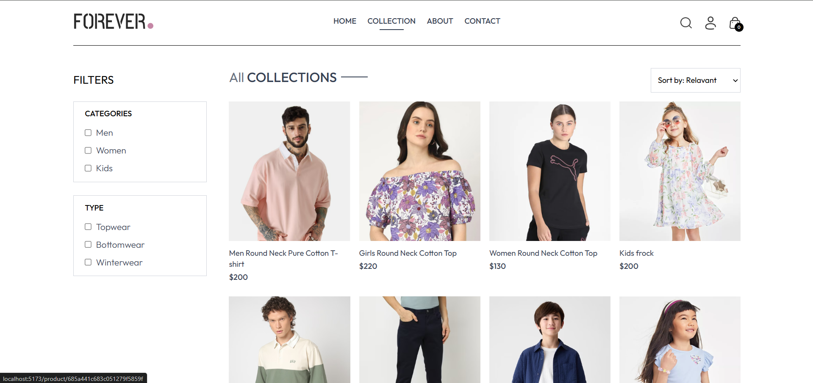
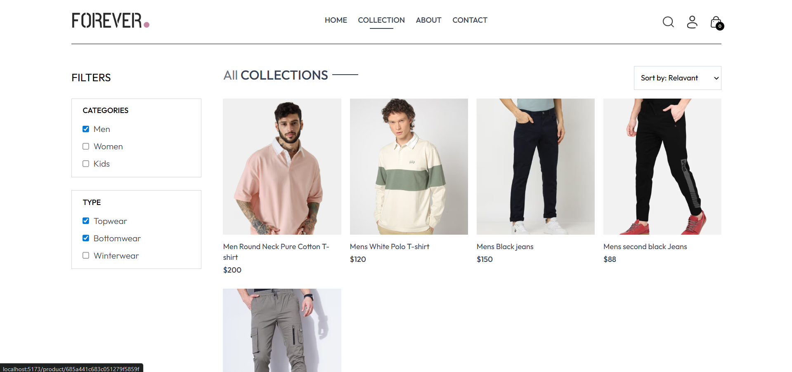
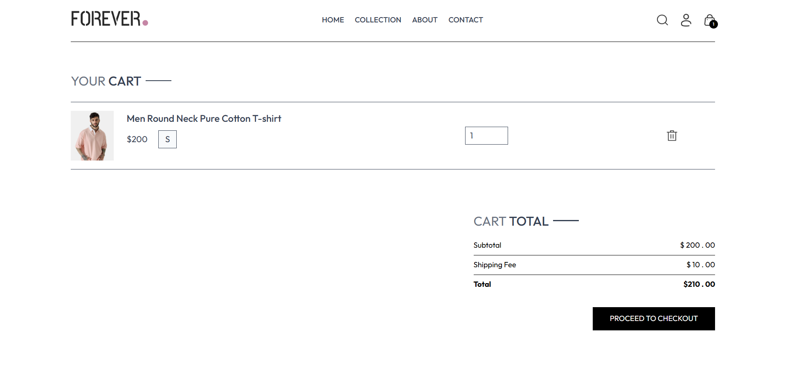
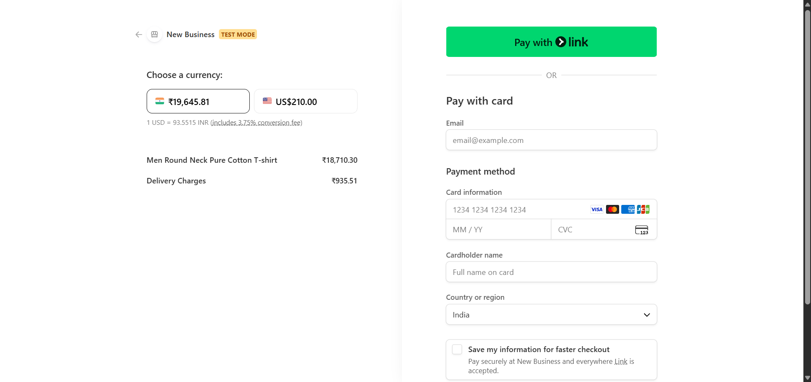
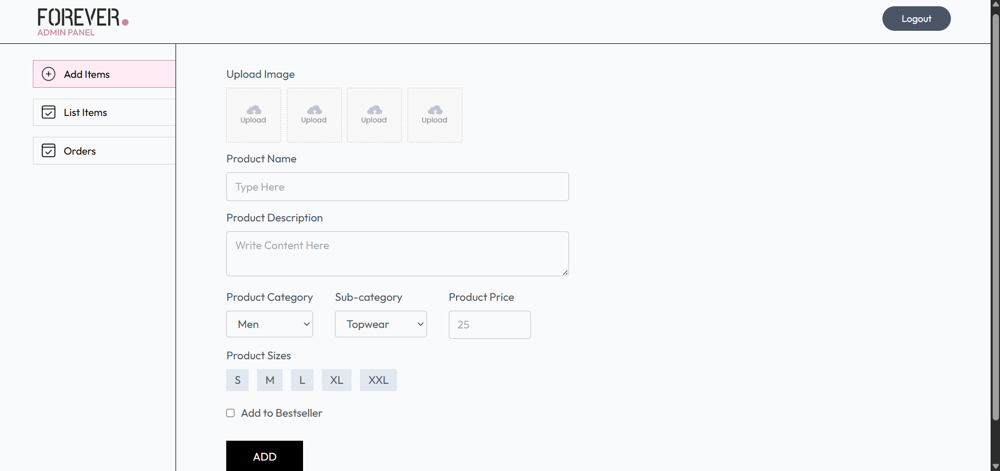

  ## MERN E‑Commerce Platform

  A full‑stack MERN e‑commerce application with a customer storefront, admin panel, and RESTful backend. Users can browse products, filter collections, manage a cart, place orders with multiple payment options (COD, Stripe, Razorpay), and track order status; admins can manage products and orders via a protected dashboard.

  ---

  ## 1. Project Title

  **MERN E‑Commerce Platform (Frontend + Admin + API)**

  ---

  ## 2. Short Project Description

This project is a production‑style e‑commerce platform built with the MERN stack. It uses a custom backend API (not a template) and two separate React SPAs (user storefront and admin panel).  
It consists of:
  - a **customer‑facing frontend** (`frontend`) for browsing products, authentication, cart management, checkout, and order history,
  - an **admin dashboard** (`admin`) for managing products and orders,
  - a **Node/Express backend** (`backend`) that exposes REST APIs, handles authentication, integrates with Cloudinary, Stripe, and Razorpay, and persists all data in MongoDB.

  All features documented below are based on the actual source code in this repository.

  ---

  ## 3. Tech Stack

-- **Frontend (User Storefront)**
  - React 19 (Vite)
  - React Router
  - Context API (`shopContext`) for global state (products, cart, auth, search)
  - Axios for HTTP requests
  - React Toastify for notifications
  - Tailwind‑style utility classes via `tailwindcss` and `@tailwindcss/vite`

- **Frontend (Admin Panel)**
  - React 19 (Vite)
  - React Router
  - Axios
  - React Toastify
  - React Hook Form (used in admin add‑product form)

  - **Backend**
    - Node.js
    - Express.js
    - Mongoose (MongoDB ODM)
    - JWT (`jsonwebtoken`) for authentication
    - bcrypt for password hashing
    - Cloudinary SDK for image uploads
    - Stripe SDK for card payments
    - Razorpay SDK for UPI/other payments
    - Multer for handling multipart/form‑data uploads
    - CORS
    - dotenv for configuration

  - **Database**
    - MongoDB (via Mongoose models: `user`, `product`, `order`)

  - **Deployment / Tooling**
    - Vite for frontend bundling
    - Vercel configuration files (`vercel.json` in `frontend`, `admin`, `backend`)

  ---

  ## 4. Key Features (Implemented)

  ### Customer Frontend (`frontend`)
  - **Product Catalog**
    - Fetch products from `GET /api/product/list`.
    - Product listing with **category** (`Men`, `Women`, `Kids`) and **type/subcategory** (`Topwear`, `Bottomwear`, `Winterwear`) filters (`Collection.jsx`).
  - Text **search** by product name when the search bar is toggled (`shopContext`, `SearchBar`, `Collection.jsx`).
  - **Latest Collection** section on home page showing newest products (`LatestCollection.jsx`).
  - **Best Seller** section showing products flagged as `bestseller` (`BestSeller.jsx`).

  - **Product Details Page**
    - Displays product images, price, description, sizes, and related products (`Product.jsx`).
    - Allows selecting size and adding items to cart via `addToCart` from `shopContext`.

  - **Cart Management**
    - In‑memory + server‑side cart stored per user (`cartData` on `userModel`).
    - Add to cart (`/api/cart/add`), update quantity (`/api/cart/update`), and fetch current cart (`/api/cart/get`) in `shopContext`.
    - Cart page shows line items, quantity inputs, and delete (set quantity to 0) (`Cart.jsx`).
    - Cart totals with subtotal, shipping, and grand total (`CartTotal.jsx`).

  - **User Authentication**
    - Register (`POST /api/user/register`) and login (`POST /api/user/login`) in `Login.jsx`.
    - JWT token stored in `localStorage` and re‑hydrated on app load (`shopContext`).
    - Authenticated requests include `headers: { token }`.

  - **Checkout & Payments**
    - **Shipping form** and order summary in `PlaceOrder.jsx`.
    - Server‑side order creation:
      - COD: `POST /api/order/place`
      - Stripe: `POST /api/order/stripe` → redirects to Stripe Checkout, then back to `/verify`.
      - Razorpay: `POST /api/order/razorpay` → opens Razorpay widget via `window.Razorpay`.
    - Stripe payment verification via `POST /api/order/verifyStripe` in `Verify.jsx`.
    - Razorpay payment verification via `POST /api/order/verifyRazorpay` in `PlaceOrder.jsx` handler.

  - **Orders & Tracking**
    - User order history fetched from `POST /api/order/userorders` (`Orders.jsx`).
    - Each order item shows product details, price, quantity, size, order date, payment method, and status.

  - **Navigation & UX**
    - Responsive navbar with routes to Home, Collection, About, Contact, Cart, and Login.
    - Profile dropdown showing **Orders** and **Logout** when logged in.
    - Mobile sidebar navigation and search icon toggle.
    - Toast notifications for success/error feedback.
  - Static **About** and **Contact** pages with brand/story content and contact information.
  - Newsletter subscription UI (no backend email storage) via `NewsletterBox.jsx`.

  ### Admin Panel (`admin`)
  - **Admin Authentication**
    - Admin login via `POST /api/user/admin` with `ADMIN_EMAIL` and `ADMIN_PASSWORD` checked on the backend.
    - JWT token stored in `localStorage` and used in protected admin routes.

  - **Product Management**
    - **Add Product** (`Add.jsx`):
      - Upload up to 4 images via Multer and Cloudinary (`/api/product/add`).
      - Set name, description, price, category, subcategory, sizes (S, M, L, XL, XXL), and bestseller flag.
    - Uses `react-hook-form` and client‑side validation for better UX.
    - **List Products** (`List.jsx`):
      - Fetch products from `GET /api/product/list`.
      - Delete product via `POST /api/product/remove` (admin‑protected).

  - **Order Management**
    - **View All Orders** (`Orders.jsx`):
      - Fetch all orders via `POST /api/order/list`.
      - See items, customer address, phone, payment method, payment status, date, and total amount.
    - **Update Order Status**:
      - Change status using `POST /api/order/status` (e.g., "Order placed", "Packing", "Shipped", "Out for delivery", "Delivered").

  ### Backend (`backend`)
  - **User Management**
    - Register and login with hashed passwords (`bcrypt`) and JWT tokens (`userController.js`).
    - Admin login using environment‑configured credentials and JWT (`adminLogin` + `adminAuth` middleware).

  - **Product Management**
    - Add product with image uploads to Cloudinary (`addProduct`).
    - List all products (`listProduct`).
    - Remove a product (`removeProduct`).
    - Fetch a single product by ID (`singleProduct`).

  - **Cart**
    - Add items to cart, update quantities, and fetch cart using `cartController.js` and `authUser` middleware.
  - Cart data is stored per‑user in the `cartData` object on the `user` document (nested by product and size).

  - **Orders & Payments**
    - `placeOrder` (COD).
    - `placeOrderStripe` with Stripe Checkout and server‑side session creation.
    - `placeOrderRazorpay` with Razorpay order creation.
    - `verifyStripe` and `verifyRazorpay` to confirm payment and clear the user’s cart.
    - `allOrders`, `userOrders`, and `updateStatus` for admin and user flows.

  ---

## 5. Screenshots

> All screenshots are stored in the `screenshots` folder at the project root.

- **User Storefront – Home Page**
  
  

- **User Storefront – Home Page (Products Section)**
  
  

- **User Storefront – Collection / Filtered Products**
  
  
  
  

- **User Storefront – Product Details Page**
  
  

- **User Storefront – Cart & Checkout Flow**
  
  
  
  
  
  

- **User Storefront – My Orders**
  
  

- **Admin Panel – Products & Orders**
  
  
  
  
  
  

  ---

## 6. Folder Structure

High‑level structure (current project layout):

```text
.
├─ admin/                      # React admin dashboard (Vite)
│  ├─ src/
│  │  ├─ App.jsx
│  │  ├─ components/           # Navbar, Sidebar, Login
│  │  ├─ pages/                # Add, List, Orders
│  │  └─ assets/               # Admin logo, icons
│  ├─ public/
│  ├─ node_modules/
│  └─ vite.config.js
│
├─ backend/                    # Node/Express API
│  ├─ config/                  # MongoDB & Cloudinary configuration
│  │  ├─ cloudinary.js
│  │  └─ mongodb.js
│  ├─ controllers/             # Route handlers (user, product, cart, order)
│  │  ├─ cartController.js
│  │  ├─ orderController.js
│  │  ├─ productController.js
│  │  └─ userController.js
│  ├─ middleware/              # Auth, adminAuth, multer
│  │  ├─ adminAuth.js
│  │  ├─ auth.js
│  │  └─ multer.js
│  ├─ models/                  # Mongoose models
│  │  ├─ orderModel.js
│  │  ├─ productModel.js
│  │  └─ userModel.js
│  ├─ routes/                  # Express routers
│  │  ├─ cartRoute.js
│  │  ├─ orderRoute.js
│  │  ├─ productRoutes.js
│  │  └─ userRoute.js
│  ├─ node_modules/
│  ├─ server.js                # Express app entry point
│  └─ vercel.json
│
├─ frontend/                   # React storefront (Vite)
│  ├─ src/
│  │  ├─ App.jsx
│  │  ├─ context/
│  │  │  └─ shopContext.jsx    # Global state (products, cart, auth, search)
│  │  ├─ components/           # Navbar, Hero, LatestCollection, BestSeller, etc.
│  │  ├─ pages/                # Home, Collection, Product, Cart, Login, PlaceOrder, Orders, Verify, About, Contact
│  │  └─ assets/               # Product images, icons, logos
│  ├─ public/
│  ├─ node_modules/
│  └─ vite.config.js
│
├─ forever-assets/             # Static design assets (not used at runtime)
│  └─ assets/
│     ├─ frontend_assets/      # Frontend demo/product images
│     └─ admin_assets/         # Admin demo assets
│
├─ screenshots/                # Project screenshots used in README
│  ├─ user_home.png
│  ├─ home_page_products.png
│  ├─ collection_page.png
│  ├─ filtered_products.png
│  ├─ product_description.png
│  ├─ cart.png
│  ├─ place_order.png
│  ├─ stripe.png
│  ├─ my_orders.png
│  ├─ admin_add_products.png
│  ├─ admin_all_products.png
│  └─ admin_order_status.png
│
└─ README.md                   # Project documentation (this file)
```

  ---

  ## 7. Setup & Run Instructions

  ### 7.1 Prerequisites

  - Node.js (LTS recommended)
  - npm or yarn
  - MongoDB instance (local or hosted, e.g. MongoDB Atlas)
  - Cloudinary account
  - Stripe account + API key
  - Razorpay account + API keys

  ### 7.2 Clone the Repository

  ```bash
  git clone [<your-repo-url>](https://github.com/aashish-arya/MERN-E-COMMERCE.git)
  cd E-Commerce-App
  ```

  ### 7.3 Backend Setup (`backend`)

  ```bash
  cd backend
  npm install
  ```

  Create a `.env` file inside `backend` (see **Environment Variables** below), then start the server:

  ```bash
  npm start      # or: node server.js
  ```

  By default the API listens on `PORT` from `.env` or `3000`.

  ### 7.4 Frontend Storefront Setup (`frontend`)

  ```bash
  cd ../frontend
  npm install
  npm run dev
  ```

  The Vite dev server URL will be shown in the terminal (commonly `http://localhost:5173`).

  ### 7.5 Admin Panel Setup (`admin`)

  ```bash
  cd ../admin
  npm install
  npm run dev
  ```

  The admin panel dev URL will be shown in the terminal (commonly another Vite port).

> **Note:** For production builds, use `npm run build` in both `frontend` and `admin`, and deploy the generated static assets (e.g., via Vercel, Netlify, or any static host). The backend can be deployed as a Node server (Vercel config is already present in `backend/vercel.json`).

  ---

  ## 8. Environment Variables

  ### 8.1 Backend (`backend/.env`)

  The backend uses `dotenv` and expects the following variables (all are used in code):

  ```env
  PORT=3000                      # optional, falls back to 3000 if missing
  MONGODB_URI=your_mongodb_uri   # MongoDB connection string (DB name "e-commerce" is appended)

  JWT_SECRET=your_jwt_secret     # JWT signing secret for users and admin

  ADMIN_EMAIL=admin@example.com  # admin login email (checked in adminLogin)
  ADMIN_PASSWORD=strongpassword  # admin login password

  CLOUDINARY_NAME=your_cloud_name
  CLOUDINARY_API_KEY=your_cloudinary_api_key
  CLOUDINARY_SECRET_KEY=your_cloudinary_secret

  STRIPE_SECRET_KEY=your_stripe_secret_key
  RAZORPAY_KEY_ID=your_razorpay_key_id
  RAZORPAY_KEY_SECRET=your_razorpay_key_secret
  ```

  **How they are used:**
  - `MONGODB_URI` is used in `mongodb.js` to connect to `MONGODB_URI + "/e-commerce"`.
  - `JWT_SECRET` signs/verifies JWTs for user and admin auth.
  - `ADMIN_EMAIL` and `ADMIN_PASSWORD` are compared directly in `adminLogin`.
  - Cloudinary variables configure `cloudinary.v2` in `cloudinary.js`.
  - Stripe and Razorpay keys are used in `orderController.js` for payment flows.

### 8.2 Frontend Storefront (`frontend/.env`)

```env
VITE_BACKEND_URL=http://localhost:3000    # Base URL for backend API
RAZORPAY_KEY_ID=your_razorpay_key_id      # Used in client Razorpay init
```

**How they are used:**
- `VITE_BACKEND_URL` is consumed in `shopContext.jsx`, `PlaceOrder.jsx`, `Verify.jsx`, and other components for Axios requests.
- `RAZORPAY_KEY_ID` (referenced as `import.meta.env.RAZORPAY_KEY_ID` in `PlaceOrder.jsx`) is used when initializing `window.Razorpay`.

  ### 8.3 Admin Panel (`admin/.env`)

  ```env
  VITE_BACKEND_URL=http://localhost:3000    # Base URL for backend API
  ```

  Used in `admin/src/App.jsx` and downstream modules (`Add.jsx`, `List.jsx`, `Orders.jsx`, `Login.jsx`) as `backendUrl`.

  ---

  ## 9. API Endpoints

  Base URL: `http://<backend-host>:<port>/api`

  ### 9.1 Auth & Users (`/api/user`)

  - **POST** `/api/user/register`  
    - Body: `{ name, email, password }`  
    - Response: `{ success, token | message }`  
    - Creates a new user, hashes password, returns JWT on success.

  - **POST** `/api/user/login`  
    - Body: `{ email, password }`  
    - Response: `{ success, token | message }`  
    - Logs in an existing user, returns JWT on success.

  - **POST** `/api/user/admin`  
    - Body: `{ email, password }`  
    - Response: `{ success, token | message }`  
    - Admin login using `ADMIN_EMAIL` and `ADMIN_PASSWORD`.

  ### 9.2 Products (`/api/product`)

  - **GET** `/api/product/list`  
    - Response: `{ success, products }`  
    - Lists all products.

  - **POST** `/api/product/add` **(Admin only)**  
    - Headers: `{ token: <admin-jwt> }`  
    - Body: `multipart/form-data` with fields:  
      - `name`, `description`, `price`, `category`, `subCategory`, `bestseller`, `sizes` (JSON string)  
      - `image1`, `image2`, `image3`, `image4` (files)  
    - Response: `{ success, message }`.

  - **POST** `/api/product/remove` **(Admin only)**  
    - Headers: `{ token: <admin-jwt> }`  
    - Body: `{ id }` (product `_id`)  
    - Response: `{ success, message }`.

  - **POST** `/api/product/single`  
    - Body: `{ productId }`  
    - Response: `{ success, product }`.

  ### 9.3 Cart (`/api/cart`) – requires user JWT

  Headers for all routes: `{ token: <user-jwt> }`

  - **POST** `/api/cart/add`  
    - Body: `{ itemId, size }`  
    - Response: `{ success, message }`  
    - Increments quantity for the given product/size in `cartData`.

  - **POST** `/api/cart/update`  
    - Body: `{ itemId, size, quantity }`  
    - Response: `{ success, message }`  
    - Sets quantity for a product/size (0 allowed to effectively remove).

  - **POST** `/api/cart/get`  
    - Body: `{}`  
    - Response: `{ success, cartData }`.

  ### 9.4 Orders (`/api/order`)

  #### Admin

  - **POST** `/api/order/list`  
    - Headers: `{ token: <admin-jwt> }`  
    - Response: `{ success, orders }`.

  - **POST** `/api/order/status`  
    - Headers: `{ token: <admin-jwt> }`  
    - Body: `{ orderId, status }`  
    - Response: `{ success, message }`.

  #### User (requires user JWT)

  Headers for all user routes: `{ token: <user-jwt> }`

  - **POST** `/api/order/place`  
    - Body: `{ userId?, items, amount, address }`  
    - `userId` is injected by `authUser` middleware.  
    - Creates COD order and clears cart.

  - **POST** `/api/order/stripe`  
    - Body: `{ userId?, items, amount, address }`  
    - Creates a Stripe Checkout session and responds with `{ success, session_url }`.

  - **POST** `/api/order/razorpay`  
    - Body: `{ userId?, items, amount, address }`  
    - Creates a Razorpay order and responds with `{ success, order }`.

  - **POST** `/api/order/userorders`  
    - Body: `{}` (userId attached by middleware)  
    - Response: `{ success, orders }`.

  - **POST** `/api/order/verifyStripe`  
    - Body: `{ success, orderId }` (and `userId` attached by middleware)  
    - If `success === 'true'`: marks payment = true and clears cart; otherwise deletes order.

  - **POST** `/api/order/verifyRazorpay`  
    - Body: `{ razorpay_order_id }` (userId attached by middleware)  
    - Verifies payment status via Razorpay API and updates order/payment accordingly.

  ---

  ## 10. Authentication & Authorization Flow

  - **User Authentication**
    - On registration/login, the backend issues a JWT signed with `JWT_SECRET`, containing the user’s Mongo `_id`.
    - Frontend stores the token in `localStorage` and React state (`shopContext`), and attaches it to requests via `headers: { token }`.
    - `auth.js` middleware verifies the token and injects `req.body.userId` into the request.

  - **Admin Authentication**
    - Admin logs in via `/api/user/admin` with credentials stored in `.env`.
    - On success, backend creates a JWT whose payload is the string `ADMIN_EMAIL + ADMIN_PASSWORD`.
    - `adminAuth.js` middleware verifies the token and checks that decoded payload matches this concatenated string.
    - Product and order admin endpoints are protected by `adminAuth`.

  - **Authorization**
    - Only authenticated users can access cart and order routes (`authUser`).
    - Only authenticated admins can add/remove products and list/update orders (`adminAuth`).

  ---

  ## 11. Database Models / Schema Overview

  ### 11.1 User (`userModel.js`)

  ```js
  {
    name: String,              // required
    email: String,             // required, unique
    password: String,          // required, hashed with bcrypt
    cartData: Object           // nested { [productId]: { [size]: quantity } }, default {}
  }
  ```

  ### 11.2 Product (`productModel.js`)

  ```js
  {
    name: String,              // required
    description: String,       // required
    price: Number,             // required
    image: Array,              // required, array of image URLs (Cloudinary)
    category: String,          // required (e.g. Men, Women, Kids)
    subCategory: String,       // required (e.g. Topwear, Bottomwear, Winterwear)
    sizes: Array,              // required (e.g. ['S', 'M', 'L'])
    bestseller: Boolean,       // required
    date: Number               // timestamp, default: Date.now
  }
  ```

  ### 11.3 Order (`orderModel.js`)

  ```js
  {
    userId: String,            // required, reference to user _id
    items: Array,              // required, product snapshots + quantity + size
    amount: Number,            // required, total including delivery
    address: Object,           // required, shipping address and phone
    status: String,            // required, default: "Order Placed"
    paymentMethod: String,     // required ("COD", "Stripe", "Razorpay")
    payment: Boolean,          // required, default: false
    date: Number               // timestamp, default: Date.now
  }
  ```

  ---

  ## 12. Live Demo Link

  This repository does not include verified live URLs in the codebase.  
  If deployed, add your links here, for example:

  - **User Storefront**: `https://mern-e-commerce-frontend-delta.vercel.app/`  
  - **Admin Panel**: `https://mern-e-commerce-admin-theta.vercel.app/`

  ---

  ## 13. GitHub Repository Link

  Update this section with your public repository URL:

  - **GitHub**: `https://github.com/aashish-arya/MERN-E-COMMERCE`

  ---

  ## 14. Future Improvements

  - **Robust Validation & Error Handling**
    - Add server‑side validation for all request bodies and stronger error responses.
  - **Role‑based Access Control**
    - Introduce roles (user/admin) encoded in JWT instead of admin concatenated secrets.
  - **Profile & Address Management**
    - Allow users to manage saved addresses and profile data.
  - **Product Reviews & Ratings**
    - Implement real review storage instead of static placeholders.
  - **Inventory Management**
    - Track stock counts per size and prevent overselling.
  - **Unit & Integration Tests**
    - Add Jest/React Testing Library and backend test coverage.

  ---

  ## 15. Challenges Faced & Learnings

  Based on the implementation, the project demonstrates:
  - **Integration of multiple payment gateways** (Stripe and Razorpay) with custom verification flows and redirect handling.
  - **Coordinated cart and order state** between frontend and backend using a nested cart structure per user.
  - **Image upload pipeline** from the admin interface through Multer to Cloudinary and back into product records.
  - **Admin vs user separation** with custom JWT‑based middleware for protected routes.
  - **Responsive React UI patterns** using context for global state and React Router for navigation in both admin and storefront.

  ---


